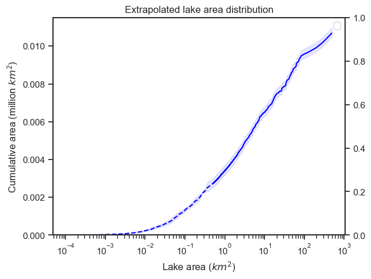

# Lake Area Distribution (LAD)
[](https://github.com/ekcomputer/lake-area/actions/workflows/python-package.yml)

**A Python package to extrapolate the lake-area distribution to small lakes and calculate their vegetation coverage and methane emissions**


## Basic Usage

This package defines two classes: `LAD` (Lake-area distribution) and `BinnedLAD`(Binned LAD). Both are based on the `pandas.DataFrame` class but have additional attributes and methods. 

An `LAD` has entries for individual lakes and columns for area, temperature, vegetation, wetland double-counting, methane emissions, and an index for traceability to the source dataset. It is typically loaded from an ESRI shapefile.

A `BinnedLAD` has entries for size bins that would comprise the histogram of lake areas. As such, it does not include individual lakes, because its primary purpose is to estimate, through extrapolation, the areas of bins below a measurement threshold. It contains many of the same attributes as a `LAD`, but only aggregated to bins. The class is typically created from an existing `LAD` object and given bin edges as follows:

```python
binned_distribution = BinnedLAD(distribution, btm=0.0001, top=0.5)
```

A `LAD` can be extrapolating with a given `binnedLAD` as reference. This operation predicts the areas of lakes below the size threshold of `LAD`, based on the reference bins. As such, it estimates lake areas only, and not their total counts.

```python
lad_trunc = lad.truncate(0.5, np.inf, inplace=False) # remove lakes below a threshold of 0.5 km2 in preparation for extrapolation
lad_lr_trunc.extrapolate(binned_distribution)
```

### Loading sample data

I have included some small, sample datasets, which can be used to ensure your installation is working and to demo its functionality. There is also a basic [notebook](notebooks/example.ipynb) with an example workflow. Tests in the [`tests`](tests) directory make use of this data and contain further examples.

```python
lad_hr_pth = '../sample_data/CIR_Canadian_Shield.shp'
lad_from_shp = LAD.from_shapefile(lad_hr_pth, area_var='Area', name='CIR', region_var='Region4')
```

### Further documentation in progress
Documentation and sample data sets still need to be created for predicting methane emissions based on temperature and lake area. There are also some pre-processing steps, which led to the sample data sets, which are not documented.

## Installation

I suggest using the `mamba` package manager (install into base environment). You can use simple `conda` commands interchangably, if you do not want to install new software. First, create a new conda/mamba environment (here called my_env) and activate it. Then:

```shell
$ mamba create -n my_env
$ mamba install -n my_env --file requirements.txt
$ mamba activate my_env
```

Access the classes and functions by importing the package. Enter the `LAD` project directory and run:

```python
from LAD.LAD import LAD, BinnedLAD
```

To run other functions, you can import them individually or import everything with `from LAD import *`.

### Optional install with pip

Once you have installed your dependicies with `mamba`, you can use pip to install `LAD`. This will ensure `LAD` is on your path no matter which directory you call it from. Using pip to install all dependencies will not work on a mac due to issues installing gdal. One workaround is running `brew install gdal` first.

```shell
pip install -e .
```

If you want to install the package in editable mode (meaning you can make changes to the code and see the changes immediately without reinstalling), you can use the -e flag above. This will help you debug any inevitable errors you catch.

### Optional requirements

To use the jupyter notebooks, you will also need to install the requirements in [requirements_optional.txt](requirements_optional.txt)

## Citing this package

**Data and software**: \
Kyzivat., E.D. and Smith, L.C. (2023). Parameters and code for estimating methane emissions from Arctic-boreal lakes, 2022. *Arctic Data Center*. [https://doi.org/10.18739/A27M04222](https://doi.org/10.18739/A27M04222) [Accessed XX-XX-XXXX]

**Journal article**: \
2.	Kyzivat, E.D. and Smith, L.C. A closer look at the effects of lake area, aquatic vegetation, and double-counted wetlands on pan-Arctic lake methane emissions estimates. In press at *Geophysical Research Letters*. [https://doi.org/10.1029/2023GL104825](https://doi.org/10.1029/2023GL104825)
## References

Sample data comes from the following sources: 

Kyzivat, E. D., Smith, L. C., Pitcher, L. H., Fayne, J. V., Cooley, S. W., Topp, S. N., Langhorst, T., Harlan, M. E., Cooper, M. G., Gleason, C. J., & Pavelsky, T. M. (2019). ABoVE: AirSWOT Water Masks from color-infrared Imagery over Alaska and Canada, 2017. In ORNL DAAC. ORNL DAAC. https://doi.org/10.3334/ORNLDAAC/1707

Kyzivat, E. D., Smith, L. C., Huang, C., Wang, C., Langhorst, T., Fayne, J. V., Harlan, M. E., Ishitsuka, Y., Feng, D., Dolan, W., Pitcher, L. H., & Pavelsky, T. M. (2021). ABoVE: UAVSAR Lake and wetland classification for Yukon Flats, Peace-Athabasca Delta, and Canadian Shield, 2017-2019. ORNL Distributed Active Archive Center. https://doi.org/10.3334/ORNLDAAC/1883

Messager, M. L., Lehner, B., Grill, G., Nedeva, I., & Schmitt, O. (2016). Estimating the volume and age of water stored in global lakes using a geo-statistical approach. Nature Communications, 7, 1–11. https://doi.org/10.1038/ncomms13603
